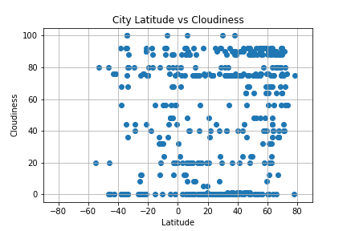
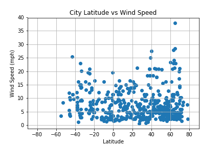

# What's the Weather Like?
Homework Week 6 - WeartherPy

This assignment uses Python libraries, the OpenWeatherMap API to create a representative model of weather across world cities and build a series of scatter plots to showcase relationship between latitude and several weather observations such as temperature, humidity, cloudiness and wind speed.

* Observations
    * There are more observations at latitudes north of the equator (+) than at latitudes south (-) of the equator.  This may be due to the general distribution of land mass being greater north of the equator 
    * Temperatures are higher nearer the equator and fall as you move away both north and south
    * Based on humidity the most arid locations are between 10 and 50 degrees north latitude


## WeatherPy Markdown


```python
#Dependencies
from citipy import citipy
from config_keys import OpWea_key
import random
import pandas as pd
import numpy as np
import matplotlib.pyplot as plt
import requests
import json
```


## Random Generate List of 500 cities
```python
#Random generate latitude and longitude numbers then lookup nearest city using citipy

# Empty series to hold names of cities and countries
randCity = []
randCountry = []
loopcnt = 0

#Loop through untill 500 unique city names are found
while len(randCity) < 500 :
    # Loop counter just to track number of loops made
    loopcnt +=1
    
    # Random generate latitude
    lat_pos = random.randint(0,2)
    base_lat = random.randint(0,91)
    dec_lat = random.random()/100
    lat = base_lat + dec_lat
    if lat_pos == 1:
        lat = lat * -1
    #print(f"The lattitude is: {lat}") 
    
    # Random generate longitude
    lng_pos = random.randint(0,2)
    base_lng = random.randint(0,181)
    dec_lng = random.random()/100
    lng = base_lng + dec_lng
    if lng_pos == 1:
        lng = lng * -1
    #print(f"The longitude is: {lng}") 
    
    # Call citipy to get nearest city based on random lat and lng
    city = citipy.nearest_city(lat, lng)
    
    # Test to see if the random city is already in the list, if not, add to the city and country lists
    foundCity = False
    for j in range(len(randCity)):
        if city.city_name == randCity[j]:
            foundCity = True
    if foundCity==False  :   
        randCity.append(city.city_name)
        randCountry.append(city.country_code)
```

## Make Calls to OpenWeather API
```python
# Build query Url
base_url = "http://api.openweathermap.org/data/2.5/weather?"
api_key = OpWea_key
units = "imperial"

query_url = base_url + "appid=" + api_key + "&units=" + units + "&q="

```


```python
# Loop through the list of cities and perform a request for data on each
search_data = []
cityList = []
countryList = []

searchCnt = 0
print("Begin API Call to OpenWeather Database ")
print("---------------------------------------")
for city in randCity:
    searchCnt += 1
    print(f"Processing record {searchCnt} for the city: {city}")   
    response = requests.get(query_url + city).json()
    searchCityID = response.get("id")
    if response.get("id"):
        print(f"     Record found for city: {city}    city id: {searchCityID}")
        search_data.append(response)
        cityList.append(city)
        countryList.append(randCountry[searchCnt-1])
    else:
        print(f"     No weather record found for city: {city}")
          
print("---------------------------------------")
print("Processing Complete")
```

    Begin API Call to OpenWeather Database 
    ---------------------------------------
    Processing record 1 for the city: belushya guba
         Record found for city: belushya guba    city id: 1487762
    Processing record 2 for the city: qurayyat
         No weather record found for city: qurayyat
    Processing record 3 for the city: sakata
         Record found for city: sakata    city id: 1853140
    Processing record 4 for the city: mulchen
         Record found for city: mulchen    city id: 3879200
    Processing record 5 for the city: rawson
         Record found for city: rawson    city id: 3839307
    Processing record 6 for the city: barentsburg
         Record found for city: barentsburg    city id: 2952767
    Processing record 7 for the city: nouadhibou
         Record found for city: nouadhibou    city id: 2377457
    Processing record 8 for the city: khatanga
         Record found for city: khatanga    city id: 2022572
    Processing record 9 for the city: illoqqortoormiut
         Record found for city: illoqqortoormiut    city id: 8013523
    Processing record 10 for the city: jamestown
         Record found for city: jamestown    city id: 5122534
    Processing record 11 for the city: beringovskiy
         Record found for city: beringovskiy    city id: 2126710
    Processing record 12 for the city: yulara
         Record found for city: yulara    city id: 6355222
    Processing record 13 for the city: nyurba
         Record found for city: nyurba    city id: 2018735
    Processing record 14 for the city: tazovskiy
         Record found for city: tazovskiy    city id: 1489853
    Processing record 15 for the city: lagoa
         Record found for city: lagoa    city id: 3372964
    Processing record 16 for the city: taolanaro
         Record found for city: taolanaro    city id: 1078317
    Processing record 17 for the city: chokurdakh
         Record found for city: chokurdakh    city id: 2126123
    Processing record 18 for the city: letterkenny
         Record found for city: letterkenny    city id: 2962961
    Processing record 19 for the city: matata
         Record found for city: matata    city id: 2187175
    Processing record 20 for the city: bredasdorp
         Record found for city: bredasdorp    city id: 1015776
    Processing record 21 for the city: ribeira grande
         Record found for city: ribeira grande    city id: 3372707
    Processing record 22 for the city: wakkanai
         Record found for city: wakkanai    city id: 2127515
    Processing record 23 for the city: lakes entrance
         Record found for city: lakes entrance    city id: 2160735
    Processing record 24 for the city: mehamn
         Record found for city: mehamn    city id: 778707
    Processing record 25 for the city: dikson
         Record found for city: dikson    city id: 1507390
    Processing record 26 for the city: nizhneudinsk
         Record found for city: nizhneudinsk    city id: 1497549
    Processing record 27 for the city: tuljapur
         Record found for city: tuljapur    city id: 1254111
    Processing record 28 for the city: xunchang
         Record found for city: xunchang    city id: 1787901
    Processing record 29 for the city: fairbanks
         Record found for city: fairbanks    city id: 5861897
    Processing record 30 for the city: bermeo
         Record found for city: bermeo    city id: 3128174
    Processing record 31 for the city: pevek
         Record found for city: pevek    city id: 2122090
    Processing record 32 for the city: barrow
         Record found for city: barrow    city id: 5880054
    Processing record 33 for the city: balabac
         Record found for city: balabac    city id: 1728675
    Processing record 34 for the city: sibu
         Record found for city: sibu    city id: 1735902
    Processing record 35 for the city: hermanus
         Record found for city: hermanus    city id: 3366880
    Processing record 36 for the city: evensk
         Record found for city: evensk    city id: 2125693
    Processing record 37 for the city: ushuaia
         Record found for city: ushuaia    city id: 3833367
    Processing record 38 for the city: talnakh
         Record found for city: talnakh    city id: 1490256
    Processing record 39 for the city: cururupu
         Record found for city: cururupu    city id: 3401148
    Processing record 40 for the city: hofn
         Record found for city: hofn    city id: 2630299
    Processing record 41 for the city: bluff
         Record found for city: bluff    city id: 2206939
    Processing record 42 for the city: zhezkazgan
         No weather record found for city: zhezkazgan
    Processing record 43 for the city: san pedro
         Record found for city: san pedro    city id: 1688781
    Processing record 44 for the city: wahran
         No weather record found for city: wahran
    Processing record 45 for the city: ponta do sol
         Record found for city: ponta do sol    city id: 2264557
    Processing record 46 for the city: rikitea
         Record found for city: rikitea    city id: 4030556
    Processing record 47 for the city: caibarien
         Record found for city: caibarien    city id: 3566356
    Processing record 48 for the city: geraldton
         Record found for city: geraldton    city id: 2070998
    Processing record 49 for the city: luderitz
         Record found for city: luderitz    city id: 3355672
    Processing record 50 for the city: anadyr
         Record found for city: anadyr    city id: 2127202
    Processing record 51 for the city: harer
         Record found for city: harer    city id: 335035
    Processing record 52 for the city: new norfolk
         Record found for city: new norfolk    city id: 2155415
    Processing record 53 for the city: bilibino
         Record found for city: bilibino    city id: 2126682
    Processing record 54 for the city: mackay
         Record found for city: mackay    city id: 2159220
    Processing record 55 for the city: tasiilaq
         Record found for city: tasiilaq    city id: 3424607
    Processing record 56 for the city: madang
         Record found for city: madang    city id: 2091996
    Processing record 57 for the city: sur
         Record found for city: sur    city id: 286245
    Processing record 58 for the city: san patricio
         Record found for city: san patricio    city id: 3985168
    Processing record 59 for the city: ilulissat
         Record found for city: ilulissat    city id: 3423146
    Processing record 60 for the city: hobart
         Record found for city: hobart    city id: 2163355
    Processing record 61 for the city: mount gambier
         Record found for city: mount gambier    city id: 2156643
    Processing record 62 for the city: galiwinku
         Record found for city: galiwinku    city id: 7839403
    Processing record 63 for the city: qaanaaq
         Record found for city: qaanaaq    city id: 3831208
    Processing record 64 for the city: dudinka
         Record found for city: dudinka    city id: 1507116
    Processing record 65 for the city: kapaa
         Record found for city: kapaa    city id: 5848280
    Processing record 66 for the city: srednekolymsk
         Record found for city: srednekolymsk    city id: 2121025
    Processing record 67 for the city: acapulco
         Record found for city: acapulco    city id: 3533462
    Processing record 68 for the city: sitka
         Record found for city: sitka    city id: 5557293
    Processing record 69 for the city: lasa
         Record found for city: lasa    city id: 3175096
    Processing record 70 for the city: norman wells
         Record found for city: norman wells    city id: 6089245
    Processing record 71 for the city: port alfred
         Record found for city: port alfred    city id: 964432
    Processing record 72 for the city: port hardy
         Record found for city: port hardy    city id: 6111862
    Processing record 73 for the city: placido de castro
         Record found for city: placido de castro    city id: 3924895
    Processing record 74 for the city: grindavik
         Record found for city: grindavik    city id: 3416888
    Processing record 75 for the city: fortuna
         Record found for city: fortuna    city id: 5563839
    Processing record 76 for the city: mar del plata
         Record found for city: mar del plata    city id: 3430863
    Processing record 77 for the city: mao
         Record found for city: mao    city id: 2514301
    Processing record 78 for the city: victoria
         Record found for city: victoria    city id: 6174041
    Processing record 79 for the city: pangkalanbuun
         Record found for city: pangkalanbuun    city id: 1632694
    Processing record 80 for the city: ust-tsilma
         Record found for city: ust-tsilma    city id: 477940
    Processing record 81 for the city: college
         Record found for city: college    city id: 5859699
    Processing record 82 for the city: berezovyy
         Record found for city: berezovyy    city id: 2026786
    Processing record 83 for the city: nizhneyansk
         Record found for city: nizhneyansk    city id: 521118
    Processing record 84 for the city: hithadhoo
         Record found for city: hithadhoo    city id: 1282256
    Processing record 85 for the city: okha
         Record found for city: okha    city id: 2122614
    Processing record 86 for the city: deputatskiy
         Record found for city: deputatskiy    city id: 2028164
    Processing record 87 for the city: palabuhanratu
         No weather record found for city: palabuhanratu
    Processing record 88 for the city: santiago
         Record found for city: santiago    city id: 3871336
    Processing record 89 for the city: hami
         Record found for city: hami    city id: 1529484
    Processing record 90 for the city: saskylakh
         Record found for city: saskylakh    city id: 2017155
    Processing record 91 for the city: puerto ayora
         Record found for city: puerto ayora    city id: 3652764
    Processing record 92 for the city: balotra
         Record found for city: balotra    city id: 1277527
    Processing record 93 for the city: bengkulu
         Record found for city: bengkulu    city id: 1649150
    Processing record 94 for the city: gizo
         Record found for city: gizo    city id: 2108857
    Processing record 95 for the city: butaritari
         Record found for city: butaritari    city id: 2110227
    Processing record 96 for the city: nemuro
         Record found for city: nemuro    city id: 2128975
    Processing record 97 for the city: salalah
         Record found for city: salalah    city id: 286621
    Processing record 98 for the city: nikolskoye
         No weather record found for city: nikolskoye
    Processing record 99 for the city: tigil
         Record found for city: tigil    city id: 2120612
    Processing record 100 for the city: saldanha
         Record found for city: saldanha    city id: 3361934
    Processing record 101 for the city: isangel
         Record found for city: isangel    city id: 2136825
    Processing record 102 for the city: hilo
         Record found for city: hilo    city id: 5855927
    Processing record 103 for the city: hirara
         Record found for city: hirara    city id: 1862505
    Processing record 104 for the city: botshabelo
         Record found for city: botshabelo    city id: 1016670
    Processing record 105 for the city: warqla
         No weather record found for city: warqla
    Processing record 106 for the city: sentyabrskiy
         Record found for city: sentyabrskiy    city id: 6696686
    Processing record 107 for the city: baherden
         Record found for city: baherden    city id: 162158
    Processing record 108 for the city: cam ranh
         Record found for city: cam ranh    city id: 1586350
    Processing record 109 for the city: batagay
         Record found for city: batagay    city id: 2027044
    Processing record 110 for the city: vanimo
         Record found for city: vanimo    city id: 2084442
    Processing record 111 for the city: ajdabiya
         Record found for city: ajdabiya    city id: 89113
    Processing record 112 for the city: san andres
         Record found for city: san andres    city id: 3670218
    Processing record 113 for the city: souillac
         Record found for city: souillac    city id: 933995
    Processing record 114 for the city: naze
         Record found for city: naze    city id: 1855540
    Processing record 115 for the city: biloela
         Record found for city: biloela    city id: 2175819
    Processing record 116 for the city: riohacha
         Record found for city: riohacha    city id: 3670745
    Processing record 117 for the city: tumannyy
         Record found for city: tumannyy    city id: 483379
    Processing record 118 for the city: albany
         Record found for city: albany    city id: 5106834
    Processing record 119 for the city: aitape
         Record found for city: aitape    city id: 2101169
    Processing record 120 for the city: leningradskiy
         Record found for city: leningradskiy    city id: 2123814
    Processing record 121 for the city: kazalinsk
         No weather record found for city: kazalinsk
    Processing record 122 for the city: cape town
         Record found for city: cape town    city id: 3369157
    Processing record 123 for the city: iranshahr
         Record found for city: iranshahr    city id: 1160939
    Processing record 124 for the city: yellowknife
         Record found for city: yellowknife    city id: 6185377
    Processing record 125 for the city: thompson
         Record found for city: thompson    city id: 6165406
    Processing record 126 for the city: noyabrsk
         Record found for city: noyabrsk    city id: 1496503
    Processing record 127 for the city: okhotsk
         Record found for city: okhotsk    city id: 2122605
    Processing record 128 for the city: saleaula
         No weather record found for city: saleaula
    Processing record 129 for the city: keti bandar
         Record found for city: keti bandar    city id: 1174451
    Processing record 130 for the city: cherskiy
         Record found for city: cherskiy    city id: 2126199
    Processing record 131 for the city: kaitangata
         Record found for city: kaitangata    city id: 2208248
    Processing record 132 for the city: primo tapia
         Record found for city: primo tapia    city id: 3979430
    Processing record 133 for the city: saint-philippe
         Record found for city: saint-philippe    city id: 935215
    Processing record 134 for the city: polson
         Record found for city: polson    city id: 5671996
    Processing record 135 for the city: kamenka
         Record found for city: kamenka    city id: 553766
    Processing record 136 for the city: mys shmidta
         Record found for city: mys shmidta    city id: 692829
    Processing record 137 for the city: sorong
         Record found for city: sorong    city id: 1626542
    Processing record 138 for the city: linguere
         No weather record found for city: linguere
    Processing record 139 for the city: clyde river
         Record found for city: clyde river    city id: 5924351
    Processing record 140 for the city: saint george
         Record found for city: saint george    city id: 5546220
    Processing record 141 for the city: maneadero
         Record found for city: maneadero    city id: 3996737
    Processing record 142 for the city: poronaysk
         Record found for city: poronaysk    city id: 2121909
    Processing record 143 for the city: punta arenas
         Record found for city: punta arenas    city id: 3874787
    Processing record 144 for the city: cumra
         Record found for city: cumra    city id: 317844
    Processing record 145 for the city: nagai
         Record found for city: nagai    city id: 2111781
    Processing record 146 for the city: corum
         Record found for city: corum    city id: 748879
    Processing record 147 for the city: camacha
         Record found for city: camacha    city id: 2270385
    Processing record 148 for the city: buala
         Record found for city: buala    city id: 2109528
    Processing record 149 for the city: broome
         Record found for city: broome    city id: 2075720
    Processing record 150 for the city: turukhansk
         Record found for city: turukhansk    city id: 1488903
    Processing record 151 for the city: itoman
         Record found for city: itoman    city id: 1861280
    Processing record 152 for the city: namibe
         Record found for city: namibe    city id: 3347019
    Processing record 153 for the city: grand river south east
         Record found for city: grand river south east    city id: 934475
    Processing record 154 for the city: vanavara
         Record found for city: vanavara    city id: 2013727
    Processing record 155 for the city: bilma
         Record found for city: bilma    city id: 2446796
    Processing record 156 for the city: pangnirtung
         Record found for city: pangnirtung    city id: 6096551
    Processing record 157 for the city: tabou
         Record found for city: tabou    city id: 2281120
    Processing record 158 for the city: fatezh
         Record found for city: fatezh    city id: 563300
    Processing record 159 for the city: sergiyevsk
         No weather record found for city: sergiyevsk
    Processing record 160 for the city: coihaique
         Record found for city: coihaique    city id: 3894426
    Processing record 161 for the city: morant bay
         Record found for city: morant bay    city id: 3489440
    Processing record 162 for the city: warwick
         Record found for city: warwick    city id: 5225507
    Processing record 163 for the city: mahadday weyne
         No weather record found for city: mahadday weyne
    Processing record 164 for the city: castro
         Record found for city: castro    city id: 3466704
    Processing record 165 for the city: mananjary
         Record found for city: mananjary    city id: 1061335
    Processing record 166 for the city: eyl
         Record found for city: eyl    city id: 60019
    Processing record 167 for the city: airai
         Record found for city: airai    city id: 660874
    Processing record 168 for the city: asau
         Record found for city: asau    city id: 686090
    Processing record 169 for the city: upernavik
         Record found for city: upernavik    city id: 3418910
    Processing record 170 for the city: mahebourg
         Record found for city: mahebourg    city id: 934322
    Processing record 171 for the city: sabang
         Record found for city: sabang    city id: 1214026
    Processing record 172 for the city: bulgan
         Record found for city: bulgan    city id: 2032201
    Processing record 173 for the city: lebu
         Record found for city: lebu    city id: 3883457
    Processing record 174 for the city: kavieng
         Record found for city: kavieng    city id: 2094342
    Processing record 175 for the city: shenjiamen
         Record found for city: shenjiamen    city id: 1795632
    Processing record 176 for the city: bada
         Record found for city: bada    city id: 2027275
    Processing record 177 for the city: vardo
         Record found for city: vardo    city id: 777019
    Processing record 178 for the city: kuche
         Record found for city: kuche    city id: 337853
    Processing record 179 for the city: nhulunbuy
         Record found for city: nhulunbuy    city id: 2064735
    Processing record 180 for the city: changde
         Record found for city: changde    city id: 1791121
    Processing record 181 for the city: kudahuvadhoo
         Record found for city: kudahuvadhoo    city id: 1337607
    Processing record 182 for the city: minot
         Record found for city: minot    city id: 5690532
    Processing record 183 for the city: osorheiu
         Record found for city: osorheiu    city id: 671644
    Processing record 184 for the city: hualmay
         Record found for city: hualmay    city id: 3939761
    Processing record 185 for the city: lappeenranta
         Record found for city: lappeenranta    city id: 648901
    Processing record 186 for the city: sibolga
         Record found for city: sibolga    city id: 1213855
    Processing record 187 for the city: tiksi
         Record found for city: tiksi    city id: 2015306
    Processing record 188 for the city: oyama
         Record found for city: oyama    city id: 1853483
    Processing record 189 for the city: lolua
         No weather record found for city: lolua
    Processing record 190 for the city: bambous virieux
         Record found for city: bambous virieux    city id: 1106677
    Processing record 191 for the city: basudebpur
         Record found for city: basudebpur    city id: 1276731
    Processing record 192 for the city: tuatapere
         Record found for city: tuatapere    city id: 2180815
    Processing record 193 for the city: bargal
         No weather record found for city: bargal
    Processing record 194 for the city: zhigansk
         Record found for city: zhigansk    city id: 2012530
    Processing record 195 for the city: namtsy
         Record found for city: namtsy    city id: 2019488
    Processing record 196 for the city: krasnyy oktyabr
         Record found for city: krasnyy oktyabr    city id: 541549
    Processing record 197 for the city: east london
         Record found for city: east london    city id: 1006984
    Processing record 198 for the city: santo antonio do sudoeste
         Record found for city: santo antonio do sudoeste    city id: 3449479
    Processing record 199 for the city: rehoboth
         Record found for city: rehoboth    city id: 3353540
    Processing record 200 for the city: barbar
         No weather record found for city: barbar
    Processing record 201 for the city: cabudare
         Record found for city: cabudare    city id: 3647637
    Processing record 202 for the city: severo-kurilsk
         Record found for city: severo-kurilsk    city id: 2121385
    Processing record 203 for the city: atuona
         Record found for city: atuona    city id: 4020109
    Processing record 204 for the city: carnarvon
         Record found for city: carnarvon    city id: 2074865
    Processing record 205 for the city: aldan
         Record found for city: aldan    city id: 2027968
    Processing record 206 for the city: port elizabeth
         Record found for city: port elizabeth    city id: 964420
    Processing record 207 for the city: tsihombe
         Record found for city: tsihombe    city id: 1054500
    Processing record 208 for the city: iqaluit
         Record found for city: iqaluit    city id: 5983720
    Processing record 209 for the city: amazar
         Record found for city: amazar    city id: 2027806
    Processing record 210 for the city: matara
         Record found for city: matara    city id: 1235846
    Processing record 211 for the city: brandon
         Record found for city: brandon    city id: 4148757
    Processing record 212 for the city: kabalo
         Record found for city: kabalo    city id: 215668
    Processing record 213 for the city: mataura
         Record found for city: mataura    city id: 1263364
    Processing record 214 for the city: amderma
         Record found for city: amderma    city id: 1544819
    Processing record 215 for the city: dumas
         Record found for city: dumas    city id: 5520552
    Processing record 216 for the city: ust-kut
         Record found for city: ust-kut    city id: 2013923
    Processing record 217 for the city: vaasa
         Record found for city: vaasa    city id: 632978
    Processing record 218 for the city: prainha
         Record found for city: prainha    city id: 3391287
    Processing record 219 for the city: leninskoye
         Record found for city: leninskoye    city id: 2020841
    Processing record 220 for the city: goksun
         Record found for city: goksun    city id: 314188
    Processing record 221 for the city: kurchum
         Record found for city: kurchum    city id: 1521762
    Processing record 222 for the city: longyearbyen
         Record found for city: longyearbyen    city id: 2729907
    Processing record 223 for the city: nola
         Record found for city: nola    city id: 6541905
    Processing record 224 for the city: turgoyak
         Record found for city: turgoyak    city id: 1488937
    Processing record 225 for the city: manjacaze
         Record found for city: manjacaze    city id: 1040938
    Processing record 226 for the city: yar-sale
         Record found for city: yar-sale    city id: 1486321
    Processing record 227 for the city: atar
         Record found for city: atar    city id: 2381334
    Processing record 228 for the city: beidao
         Record found for city: beidao    city id: 1816751
    Processing record 229 for the city: awjilah
         Record found for city: awjilah    city id: 88533
    Processing record 230 for the city: kargasok
         Record found for city: kargasok    city id: 1504382
    Processing record 231 for the city: phan rang
         No weather record found for city: phan rang
    Processing record 232 for the city: touros
         Record found for city: touros    city id: 3386213
    Processing record 233 for the city: bondowoso
         Record found for city: bondowoso    city id: 1648266
    Processing record 234 for the city: preobrazhenskaya
         No weather record found for city: preobrazhenskaya
    Processing record 235 for the city: santa margherita ligure
         Record found for city: santa margherita ligure    city id: 3167595
    Processing record 236 for the city: kiunga
         Record found for city: kiunga    city id: 2093846
    Processing record 237 for the city: uthal
         Record found for city: uthal    city id: 1162862
    Processing record 238 for the city: anloga
         Record found for city: anloga    city id: 2304548
    Processing record 239 for the city: yerbogachen
         Record found for city: yerbogachen    city id: 2012956
    Processing record 240 for the city: vendome
         Record found for city: vendome    city id: 2970110
    Processing record 241 for the city: cayenne
         Record found for city: cayenne    city id: 3382160
    Processing record 242 for the city: taunggyi
         Record found for city: taunggyi    city id: 1293960
    Processing record 243 for the city: le port
         Record found for city: le port    city id: 935616
    Processing record 244 for the city: marrakesh
         Record found for city: marrakesh    city id: 2542997
    Processing record 245 for the city: puerto escondido
         Record found for city: puerto escondido    city id: 3520994
    Processing record 246 for the city: kemijarvi
         Record found for city: kemijarvi    city id: 653272
    Processing record 247 for the city: ondjiva
         Record found for city: ondjiva    city id: 3346821
    Processing record 248 for the city: teseney
         Record found for city: teseney    city id: 327651
    Processing record 249 for the city: kaeo
         Record found for city: kaeo    city id: 2189343
    Processing record 250 for the city: marfino
         Record found for city: marfino    city id: 529368
    Processing record 251 for the city: inderborskiy
         No weather record found for city: inderborskiy
    Processing record 252 for the city: kodiak
         Record found for city: kodiak    city id: 5866583
    Processing record 253 for the city: impfondo
         Record found for city: impfondo    city id: 2259655
    Processing record 254 for the city: kolosovka
         Record found for city: kolosovka    city id: 1502879
    Processing record 255 for the city: kamenskoye
         Record found for city: kamenskoye    city id: 709932
    Processing record 256 for the city: te anau
         Record found for city: te anau    city id: 2181625
    Processing record 257 for the city: pecos
         Record found for city: pecos    city id: 5528182
    Processing record 258 for the city: tuktoyaktuk
         Record found for city: tuktoyaktuk    city id: 6170031
    Processing record 259 for the city: sinnamary
         Record found for city: sinnamary    city id: 3380290
    Processing record 260 for the city: beruwala
         Record found for city: beruwala    city id: 1249931
    Processing record 261 for the city: henties bay
         No weather record found for city: henties bay
    Processing record 262 for the city: avarua
         Record found for city: avarua    city id: 4035715
    Processing record 263 for the city: sept-iles
         Record found for city: sept-iles    city id: 6144312
    Processing record 264 for the city: guerrero negro
         Record found for city: guerrero negro    city id: 4021858
    Processing record 265 for the city: wagar
         Record found for city: wagar    city id: 364027
    Processing record 266 for the city: kutum
         Record found for city: kutum    city id: 371745
    Processing record 267 for the city: kumluca
         Record found for city: kumluca    city id: 305681
    Processing record 268 for the city: rawlins
         Record found for city: rawlins    city id: 5836068
    Processing record 269 for the city: magistralnyy
         Record found for city: magistralnyy    city id: 2020584
    Processing record 270 for the city: shirvan
         No weather record found for city: shirvan
    Processing record 271 for the city: khandyga
         Record found for city: khandyga    city id: 2022773
    Processing record 272 for the city: sao filipe
         Record found for city: sao filipe    city id: 3374210
    Processing record 273 for the city: la ronge
         Record found for city: la ronge    city id: 6050066
    Processing record 274 for the city: tateyama
         Record found for city: tateyama    city id: 1850523
    Processing record 275 for the city: lima
         Record found for city: lima    city id: 3936456
    Processing record 276 for the city: elko
         Record found for city: elko    city id: 5703670
    Processing record 277 for the city: ulaanbaatar
         Record found for city: ulaanbaatar    city id: 2028462
    Processing record 278 for the city: armizonskoye
         Record found for city: armizonskoye    city id: 1511382
    Processing record 279 for the city: verkhnevilyuysk
         Record found for city: verkhnevilyuysk    city id: 2013639
    Processing record 280 for the city: champerico
         Record found for city: champerico    city id: 3598787
    Processing record 281 for the city: gboko
         No weather record found for city: gboko
    Processing record 282 for the city: egvekinot
         Record found for city: egvekinot    city id: 4031742
    Processing record 283 for the city: krasnoselkup
         No weather record found for city: krasnoselkup
    Processing record 284 for the city: benalla
         Record found for city: benalla    city id: 2176225
    Processing record 285 for the city: narsaq
         Record found for city: narsaq    city id: 3421719
    Processing record 286 for the city: balud
         Record found for city: balud    city id: 1727792
    Processing record 287 for the city: bindura
         Record found for city: bindura    city id: 895061
    Processing record 288 for the city: taltal
         Record found for city: taltal    city id: 3870243
    Processing record 289 for the city: najran
         Record found for city: najran    city id: 103630
    Processing record 290 for the city: magadan
         Record found for city: magadan    city id: 2123628
    Processing record 291 for the city: busselton
         Record found for city: busselton    city id: 2075265
    Processing record 292 for the city: hasaki
         Record found for city: hasaki    city id: 2112802
    Processing record 293 for the city: qibili
         No weather record found for city: qibili
    Processing record 294 for the city: willowmore
         Record found for city: willowmore    city id: 939676
    Processing record 295 for the city: mandalgovi
         Record found for city: mandalgovi    city id: 2030065
    Processing record 296 for the city: tabialan
         No weather record found for city: tabialan
    Processing record 297 for the city: vadso
         Record found for city: vadso    city id: 777073
    Processing record 298 for the city: natitingou
         Record found for city: natitingou    city id: 2392601
    Processing record 299 for the city: kavaratti
         Record found for city: kavaratti    city id: 1267390
    Processing record 300 for the city: batemans bay
         Record found for city: batemans bay    city id: 2176639
    Processing record 301 for the city: khagrachari
         No weather record found for city: khagrachari
    Processing record 302 for the city: kushima
         Record found for city: kushima    city id: 1895695
    Processing record 303 for the city: soe
         Record found for city: soe    city id: 1626703
    Processing record 304 for the city: belaya gora
         Record found for city: belaya gora    city id: 2126785
    Processing record 305 for the city: miles city
         Record found for city: miles city    city id: 5666176
    Processing record 306 for the city: codrington
         Record found for city: codrington    city id: 2171099
    Processing record 307 for the city: sangar
         Record found for city: sangar    city id: 2017215
    Processing record 308 for the city: aflu
         No weather record found for city: aflu
    Processing record 309 for the city: vestmannaeyjar
         Record found for city: vestmannaeyjar    city id: 3412093
    Processing record 310 for the city: fougamou
         Record found for city: fougamou    city id: 2400578
    Processing record 311 for the city: rudnya
         Record found for city: rudnya    city id: 500667
    Processing record 312 for the city: sabha
         Record found for city: sabha    city id: 2212775
    Processing record 313 for the city: anakapalle
         Record found for city: anakapalle    city id: 1278688
    Processing record 314 for the city: tarudant
         No weather record found for city: tarudant
    Processing record 315 for the city: seymchan
         Record found for city: seymchan    city id: 2121373
    Processing record 316 for the city: jasper
         Record found for city: jasper    city id: 4259640
    Processing record 317 for the city: karlshamn
         Record found for city: karlshamn    city id: 2701727
    Processing record 318 for the city: chingola
         Record found for city: chingola    city id: 919009
    Processing record 319 for the city: shingu
         Record found for city: shingu    city id: 1847947
    Processing record 320 for the city: vostok
         Record found for city: vostok    city id: 2013279
    Processing record 321 for the city: warrington
         Record found for city: warrington    city id: 2634739
    Processing record 322 for the city: sfantu gheorghe
         Record found for city: sfantu gheorghe    city id: 667306
    Processing record 323 for the city: dekoa
         No weather record found for city: dekoa
    Processing record 324 for the city: kampot
         Record found for city: kampot    city id: 1831112
    Processing record 325 for the city: peruibe
         Record found for city: peruibe    city id: 3454061
    Processing record 326 for the city: orda
         Record found for city: orda    city id: 515098
    Processing record 327 for the city: leh
         Record found for city: leh    city id: 1264976
    Processing record 328 for the city: garissa
         Record found for city: garissa    city id: 197745
    Processing record 329 for the city: puerto cabezas
         Record found for city: puerto cabezas    city id: 3617154
    Processing record 330 for the city: ginda
         No weather record found for city: ginda
    Processing record 331 for the city: chuy
         Record found for city: chuy    city id: 3443061
    Processing record 332 for the city: oktyabrskiy
         Record found for city: oktyabrskiy    city id: 515879
    Processing record 333 for the city: boksitogorsk
         Record found for city: boksitogorsk    city id: 575410
    Processing record 334 for the city: sarangani
         Record found for city: sarangani    city id: 1687186
    Processing record 335 for the city: arraial do cabo
         Record found for city: arraial do cabo    city id: 3471451
    Processing record 336 for the city: kalanwali
         Record found for city: kalanwali    city id: 1268469
    Processing record 337 for the city: tukrah
         No weather record found for city: tukrah
    Processing record 338 for the city: amapa
         Record found for city: amapa    city id: 3396016
    Processing record 339 for the city: nanortalik
         Record found for city: nanortalik    city id: 3421765
    Processing record 340 for the city: walvis bay
         Record found for city: walvis bay    city id: 3359638
    Processing record 341 for the city: hvide sande
         Record found for city: hvide sande    city id: 2619537
    Processing record 342 for the city: kawalu
         Record found for city: kawalu    city id: 1640902
    Processing record 343 for the city: mount darwin
         Record found for city: mount darwin    city id: 885800
    Processing record 344 for the city: venustiano carranza
         Record found for city: venustiano carranza    city id: 3827407
    Processing record 345 for the city: esperance
         Record found for city: esperance    city id: 2071860
    Processing record 346 for the city: marcona
         Record found for city: marcona    city id: 3929520
    Processing record 347 for the city: siirt
         Record found for city: siirt    city id: 300822
    Processing record 348 for the city: storslett
         Record found for city: storslett    city id: 777381
    Processing record 349 for the city: haimen
         Record found for city: haimen    city id: 1809062
    Processing record 350 for the city: keizer
         Record found for city: keizer    city id: 5734711
    Processing record 351 for the city: quatre cocos
         Record found for city: quatre cocos    city id: 1106643
    Processing record 352 for the city: novyy urengoy
         Record found for city: novyy urengoy    city id: 1496511
    Processing record 353 for the city: umzimvubu
         No weather record found for city: umzimvubu
    Processing record 354 for the city: port-gentil
         Record found for city: port-gentil    city id: 2396518
    Processing record 355 for the city: itupiranga
         Record found for city: itupiranga    city id: 3397851
    Processing record 356 for the city: richards bay
         Record found for city: richards bay    city id: 962367
    Processing record 357 for the city: kotka
         Record found for city: kotka    city id: 650950
    Processing record 358 for the city: qingyuan
         Record found for city: qingyuan    city id: 1797945
    Processing record 359 for the city: ossora
         Record found for city: ossora    city id: 2122389
    Processing record 360 for the city: mokhsogollokh
         Record found for city: mokhsogollokh    city id: 2019867
    Processing record 361 for the city: lorengau
         Record found for city: lorengau    city id: 2092164
    Processing record 362 for the city: ribeira brava
         Record found for city: ribeira brava    city id: 2263905
    Processing record 363 for the city: rumoi
         Record found for city: rumoi    city id: 2128382
    Processing record 364 for the city: daru
         Record found for city: daru    city id: 2098329
    Processing record 365 for the city: talcahuano
         Record found for city: talcahuano    city id: 3870282
    Processing record 366 for the city: vaini
         Record found for city: vaini    city id: 4032243
    Processing record 367 for the city: makat
         No weather record found for city: makat
    Processing record 368 for the city: zhangye
         Record found for city: zhangye    city id: 1785036
    Processing record 369 for the city: gwadar
         Record found for city: gwadar    city id: 1177446
    Processing record 370 for the city: bam
         Record found for city: bam    city id: 141736
    Processing record 371 for the city: mukhen
         Record found for city: mukhen    city id: 2019718
    Processing record 372 for the city: zolotinka
         No weather record found for city: zolotinka
    Processing record 373 for the city: chenghai
         Record found for city: chenghai    city id: 6682582
    Processing record 374 for the city: san ignacio
         Record found for city: san ignacio    city id: 3581194
    Processing record 375 for the city: namatanai
         Record found for city: namatanai    city id: 2090021
    Processing record 376 for the city: straumen
         Record found for city: straumen    city id: 3135728
    Processing record 377 for the city: shiyan
         Record found for city: shiyan    city id: 1794903
    Processing record 378 for the city: san juan de colon
         Record found for city: san juan de colon    city id: 3628060
    Processing record 379 for the city: kungurtug
         Record found for city: kungurtug    city id: 1501377
    Processing record 380 for the city: dunedin
         Record found for city: dunedin    city id: 2191562
    Processing record 381 for the city: comodoro rivadavia
         Record found for city: comodoro rivadavia    city id: 3860443
    Processing record 382 for the city: macaboboni
         No weather record found for city: macaboboni
    Processing record 383 for the city: gat
         No weather record found for city: gat
    Processing record 384 for the city: port blair
         Record found for city: port blair    city id: 1259385
    Processing record 385 for the city: troitskoye
         Record found for city: troitskoye    city id: 1489209
    Processing record 386 for the city: maiduguri
         Record found for city: maiduguri    city id: 2331447
    Processing record 387 for the city: cabinda
         Record found for city: cabinda    city id: 2243271
    Processing record 388 for the city: adet
         No weather record found for city: adet
    Processing record 389 for the city: boralday
         No weather record found for city: boralday
    Processing record 390 for the city: mangan
         Record found for city: mangan    city id: 1263776
    Processing record 391 for the city: dzhebariki-khaya
         Record found for city: dzhebariki-khaya    city id: 2024626
    Processing record 392 for the city: tiznit
         Record found for city: tiznit    city id: 2527087
    Processing record 393 for the city: ouango
         Record found for city: ouango    city id: 236844
    Processing record 394 for the city: lovozero
         Record found for city: lovozero    city id: 533933
    Processing record 395 for the city: baoying
         Record found for city: baoying    city id: 1816890
    Processing record 396 for the city: faridan
         No weather record found for city: faridan
    Processing record 397 for the city: gorontalo
         Record found for city: gorontalo    city id: 1643837
    Processing record 398 for the city: suicheng
         Record found for city: suicheng    city id: 1793899
    Processing record 399 for the city: labuhan
         Record found for city: labuhan    city id: 8079926
    Processing record 400 for the city: skalistyy
         Record found for city: skalistyy    city id: 505230
    Processing record 401 for the city: lensk
         Record found for city: lensk    city id: 2020838
    Processing record 402 for the city: bereda
         No weather record found for city: bereda
    Processing record 403 for the city: rungata
         No weather record found for city: rungata
    Processing record 404 for the city: hamadan
         Record found for city: hamadan    city id: 132144
    Processing record 405 for the city: olafsvik
         Record found for city: olafsvik    city id: 3414079
    Processing record 406 for the city: porto-vecchio
         Record found for city: porto-vecchio    city id: 2985947
    Processing record 407 for the city: klyuchi
         Record found for city: klyuchi    city id: 1503153
    Processing record 408 for the city: suntar
         Record found for city: suntar    city id: 2015913
    Processing record 409 for the city: kohlu
         Record found for city: kohlu    city id: 1173464
    Processing record 410 for the city: port lincoln
         Record found for city: port lincoln    city id: 2063036
    Processing record 411 for the city: orje
         Record found for city: orje    city id: 3143427
    Processing record 412 for the city: attawapiskat
         Record found for city: attawapiskat    city id: 5989520
    Processing record 413 for the city: yanan
         No weather record found for city: yanan
    Processing record 414 for the city: tura
         Record found for city: tura    city id: 1254046
    Processing record 415 for the city: carlsbad
         Record found for city: carlsbad    city id: 5334223
    Processing record 416 for the city: epe
         Record found for city: epe    city id: 2343252
    Processing record 417 for the city: teacapan
         Record found for city: teacapan    city id: 3982287
    Processing record 418 for the city: sechenovo
         Record found for city: sechenovo    city id: 497984
    Processing record 419 for the city: kokopo
         Record found for city: kokopo    city id: 2093685
    Processing record 420 for the city: hagersville
         Record found for city: hagersville    city id: 5968875
    Processing record 421 for the city: phangnga
         Record found for city: phangnga    city id: 1151464
    Processing record 422 for the city: zonguldak
         Record found for city: zonguldak    city id: 737021
    Processing record 423 for the city: nyagan
         Record found for city: nyagan    city id: 1496476
    Processing record 424 for the city: lewiston
         Record found for city: lewiston    city id: 4969398
    Processing record 425 for the city: moron
         Record found for city: moron    city id: 3430545
    Processing record 426 for the city: samos
         Record found for city: samos    city id: 254115
    Processing record 427 for the city: constitucion
         Record found for city: constitucion    city id: 3893726
    Processing record 428 for the city: miri
         Record found for city: miri    city id: 1738050
    Processing record 429 for the city: karlskrona
         Record found for city: karlskrona    city id: 2701713
    Processing record 430 for the city: ibra
         Record found for city: ibra    city id: 287832
    Processing record 431 for the city: fukagawa
         Record found for city: fukagawa    city id: 2130332
    Processing record 432 for the city: jizan
         Record found for city: jizan    city id: 105299
    Processing record 433 for the city: peniche
         Record found for city: peniche    city id: 2264923
    Processing record 434 for the city: parabel
         Record found for city: parabel    city id: 1495586
    Processing record 435 for the city: ulaangom
         Record found for city: ulaangom    city id: 1515029
    Processing record 436 for the city: bethel
         Record found for city: bethel    city id: 5282297
    Processing record 437 for the city: lodwar
         Record found for city: lodwar    city id: 189280
    Processing record 438 for the city: luocheng
         Record found for city: luocheng    city id: 1801983
    Processing record 439 for the city: marawi
         Record found for city: marawi    city id: 1701054
    Processing record 440 for the city: quzhou
         Record found for city: quzhou    city id: 1797264
    Processing record 441 for the city: fort nelson
         Record found for city: fort nelson    city id: 5955902
    Processing record 442 for the city: hambantota
         Record found for city: hambantota    city id: 1244926
    Processing record 443 for the city: vao
         Record found for city: vao    city id: 2137773
    Processing record 444 for the city: itarema
         No weather record found for city: itarema
    Processing record 445 for the city: georgetown
         Record found for city: georgetown    city id: 3378644
    Processing record 446 for the city: adre
         Record found for city: adre    city id: 245669
    Processing record 447 for the city: deep river
         Record found for city: deep river    city id: 5937073
    Processing record 448 for the city: ornskoldsvik
         Record found for city: ornskoldsvik    city id: 2686469
    Processing record 449 for the city: mitsamiouli
         Record found for city: mitsamiouli    city id: 921786
    Processing record 450 for the city: ponta delgada
         Record found for city: ponta delgada    city id: 3372783
    Processing record 451 for the city: kahului
         Record found for city: kahului    city id: 5847411
    Processing record 452 for the city: darab
         Record found for city: darab    city id: 137956
    Processing record 453 for the city: spornoye
         No weather record found for city: spornoye
    Processing record 454 for the city: sorland
         Record found for city: sorland    city id: 3137469
    Processing record 455 for the city: verkhoyansk
         Record found for city: verkhoyansk    city id: 2013465
    Processing record 456 for the city: plyussa
         Record found for city: plyussa    city id: 508743
    Processing record 457 for the city: honningsvag
         Record found for city: honningsvag    city id: 779554
    Processing record 458 for the city: kruisfontein
         Record found for city: kruisfontein    city id: 986717
    Processing record 459 for the city: bukama
         Record found for city: bukama    city id: 217834
    Processing record 460 for the city: vyartsilya
         Record found for city: vyartsilya    city id: 470762
    Processing record 461 for the city: manggar
         Record found for city: manggar    city id: 1636426
    Processing record 462 for the city: toora-khem
         Record found for city: toora-khem    city id: 1489401
    Processing record 463 for the city: stamsund
         No weather record found for city: stamsund
    Processing record 464 for the city: larsnes
         Record found for city: larsnes    city id: 3148133
    Processing record 465 for the city: khonsa
         Record found for city: khonsa    city id: 1266668
    Processing record 466 for the city: ancud
         Record found for city: ancud    city id: 3899695
    Processing record 467 for the city: dongobesh
         Record found for city: dongobesh    city id: 160172
    Processing record 468 for the city: nuuk
         Record found for city: nuuk    city id: 3421319
    Processing record 469 for the city: virginia beach
         Record found for city: virginia beach    city id: 4791259
    Processing record 470 for the city: omboue
         Record found for city: omboue    city id: 2396853
    Processing record 471 for the city: sawakin
         Record found for city: sawakin    city id: 367544
    Processing record 472 for the city: duku
         Record found for city: duku    city id: 2344415
    Processing record 473 for the city: kraslava
         Record found for city: kraslava    city id: 458623
    Processing record 474 for the city: petropavlovsk-kamchatskiy
         Record found for city: petropavlovsk-kamchatskiy    city id: 2122104
    Processing record 475 for the city: pierre
         Record found for city: pierre    city id: 5767918
    Processing record 476 for the city: solnechnyy
         Record found for city: solnechnyy    city id: 2016307
    Processing record 477 for the city: adrar
         Record found for city: adrar    city id: 2508813
    Processing record 478 for the city: kampene
         Record found for city: kampene    city id: 214575
    Processing record 479 for the city: berlevag
         Record found for city: berlevag    city id: 780687
    Processing record 480 for the city: vila franca do campo
         Record found for city: vila franca do campo    city id: 3372472
    Processing record 481 for the city: tera
         Record found for city: tera    city id: 2438855
    Processing record 482 for the city: timmins
         Record found for city: timmins    city id: 6166739
    Processing record 483 for the city: ruatoria
         No weather record found for city: ruatoria
    Processing record 484 for the city: nizamabad
         Record found for city: nizamabad    city id: 1261258
    Processing record 485 for the city: mogadishu
         Record found for city: mogadishu    city id: 53654
    Processing record 486 for the city: makubetsu
         Record found for city: makubetsu    city id: 2129324
    Processing record 487 for the city: kloulklubed
         Record found for city: kloulklubed    city id: 7671223
    Processing record 488 for the city: bathsheba
         Record found for city: bathsheba    city id: 3374083
    Processing record 489 for the city: chernyshevskiy
         Record found for city: chernyshevskiy    city id: 2025456
    Processing record 490 for the city: andenes
         Record found for city: andenes    city id: 3163146
    Processing record 491 for the city: hamilton
         Record found for city: hamilton    city id: 5969785
    Processing record 492 for the city: cheney
         Record found for city: cheney    city id: 5789856
    Processing record 493 for the city: fallon
         Record found for city: fallon    city id: 5503914
    Processing record 494 for the city: gampaha
         Record found for city: gampaha    city id: 1246007
    Processing record 495 for the city: wuda
         Record found for city: wuda    city id: 1791325
    Processing record 496 for the city: ngukurr
         No weather record found for city: ngukurr
    Processing record 497 for the city: manbij
         Record found for city: manbij    city id: 167357
    Processing record 498 for the city: achit
         Record found for city: achit    city id: 584308
    Processing record 499 for the city: norrtalje
         Record found for city: norrtalje    city id: 2688250
    Processing record 500 for the city: ust-omchug
         Record found for city: ust-omchug    city id: 2120047
    ---------------------------------------
    Processing Complete
    


```python
#print(json.dumps(search_data[2], indent=4))
len(search_data)
```


    455


## Load data from API calls into a data frame

```python
# Use list comprehension to gather necessary data series

lat_data = [data.get("coord").get("lat") for data in search_data]
lng_data = [data.get("coord").get("lon") for data in search_data]
temp_data = [data.get("main").get("temp") for data in search_data]
humid_data = [data.get("main").get("humidity") for data in search_data]
cloud_data =[data.get("clouds").get("all") for data in search_data]
wind_data = [data.get("wind").get("speed") for data in search_data]
```


```python
# Create data frame with aggregated data
weather_data = pd.DataFrame({"cityName":cityList,
                            "country":countryList,
                            "lat":lat_data,
                            "lng":lng_data,
                            "temp":temp_data,
                            "humidity":humid_data,
                            "cloudiness":cloud_data,
                            "winds":wind_data})

```


```python
# Force column order
weather_data = weather_data[["cityName","country","lat","lng","temp","humidity","cloudiness","winds"]]
weather_data.head()
```


<div>
<table border="1" class="dataframe">
  <thead>
    <tr style="text-align: right;">
      <th></th>
      <th>cityName</th>
      <th>country</th>
      <th>lat</th>
      <th>lng</th>
      <th>temp</th>
      <th>humidity</th>
      <th>cloudiness</th>
      <th>winds</th>
    </tr>
  </thead>
  <tbody>
    <tr>
      <th>0</th>
      <td>belushya guba</td>
      <td>ru</td>
      <td>69.71</td>
      <td>60.05</td>
      <td>18.31</td>
      <td>100</td>
      <td>92</td>
      <td>21.05</td>
    </tr>
    <tr>
      <th>1</th>
      <td>sakata</td>
      <td>jp</td>
      <td>38.92</td>
      <td>139.85</td>
      <td>55.89</td>
      <td>100</td>
      <td>88</td>
      <td>13.89</td>
    </tr>
    <tr>
      <th>2</th>
      <td>mulchen</td>
      <td>cl</td>
      <td>-37.72</td>
      <td>-72.23</td>
      <td>72.22</td>
      <td>64</td>
      <td>0</td>
      <td>5.79</td>
    </tr>
    <tr>
      <th>3</th>
      <td>rawson</td>
      <td>ar</td>
      <td>-43.30</td>
      <td>-65.10</td>
      <td>66.28</td>
      <td>58</td>
      <td>76</td>
      <td>25.41</td>
    </tr>
    <tr>
      <th>4</th>
      <td>barentsburg</td>
      <td>sj</td>
      <td>52.62</td>
      <td>8.80</td>
      <td>39.31</td>
      <td>93</td>
      <td>0</td>
      <td>3.36</td>
    </tr>
  </tbody>
</table>
</div>


```python
# Save weather data to csv file
weather_data.to_csv("weather_data.csv", encoding="utf-8", index=False)
```

## Create scatter plots based on weather data
```python
# Build a scatter plot for each data type

# Latitude vs Max Temp
plt.scatter(weather_data["lat"], weather_data["temp"], marker="o")

# Add chart labels
plt.title("City Latitude vs Max Temperature")
plt.ylabel("Temperature (F) ")
plt.xlabel("Latitude")
plt.grid(True)
plt.xlim(-90,90)

# Save the figure
plt.savefig("Latitude_vs_MaxTemp.png")

# Show plot
plt.show()
```


```python
# Latitude vs Humidity
plt.scatter(weather_data["lat"], weather_data["humidity"], marker="o")

# Add chart labels
plt.title("City Latitude vs Humidity")
plt.ylabel("Humidity")
plt.xlabel("Latitude")
plt.grid(True)
plt.xlim(-90,90)

# Save the figure
plt.savefig("Latitude_vs_Humidity.png")

# Show plot
plt.show()
```


```python
# Latitude vs Cloudiness
plt.scatter(weather_data["lat"], weather_data["cloudiness"], marker="o")

# Add chart labels
plt.title("City Latitude vs Cloudiness")
plt.ylabel("Cloudiness")
plt.xlabel("Latitude")
plt.grid(True)
plt.xlim(-90,90)

# Save the figure
plt.savefig("Latitude_vs_Cloudiness.png")

# Show plot
plt.show()
```





```python
# Latitude vs Wind Speed
plt.scatter(weather_data["lat"], weather_data["winds"], marker="o")

# Add chart labels
plt.title("City Latitude vs Wind Speed")
plt.ylabel("Wind Speed (mph)")
plt.xlabel("Latitude")
plt.grid(True)
plt.xlim(-90,90)

# Save the figure
plt.savefig("Latitude_vs_WindSpeed.png")

# Show plot
plt.show()
```





```python

```
