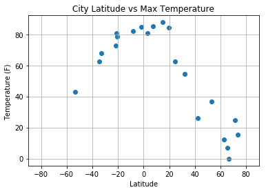
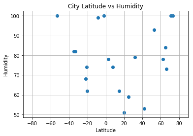
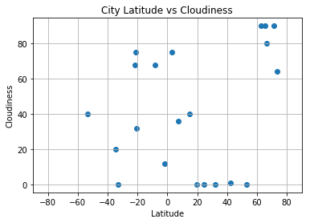
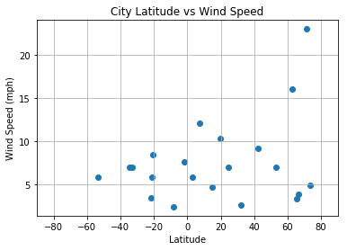

```python
#Dependencies
from citipy import citipy
from config_keys import OpWea_key
import random
import pandas as pd
import numpy as np
import matplotlib.pyplot as plt
import requests
import json
```


```python
#Random generate latitude and longitude numbers then lookup nearest city using citipy

# Empty series to hold names of cities and countries
randCity = []
randCountry = []
loopcnt = 0

#Loop through untill 500 unique city names are found
while len(randCity) < 25 :
    # Loop counter just to track number of loops made
    loopcnt +=1
    
    # Random generate latitude
    lat_pos = random.randint(0,2)
    base_lat = random.randint(0,91)
    dec_lat = random.random()/100
    lat = base_lat + dec_lat
    if lat_pos == 1:
        lat = lat * -1
    #print(f"The lattitude is: {lat}") 
    
    # Random generate longitude
    lng_pos = random.randint(0,2)
    base_lng = random.randint(0,181)
    dec_lng = random.random()/100
    lng = base_lng + dec_lng
    if lng_pos == 1:
        lng = lng * -1
    #print(f"The longitude is: {lng}") 
    
    # Call citipy to get nearest city based on random lat and lng
    city = citipy.nearest_city(lat, lng)
    
    # Test to see if the random city is already in the list, if not, add to the city and country lists
    foundCity = False
    for j in range(len(randCity)):
        if city.city_name == randCity[j]:
            foundCity = True
    if foundCity==False  :   
        randCity.append(city.city_name)
        randCountry.append(city.country_code)
```


```python
# Build query Url
base_url = "http://api.openweathermap.org/data/2.5/weather?"
api_key = OpWea_key
units = "imperial"

query_url = base_url + "appid=" + api_key + "&units=" + units + "&q="

```


```python
# Loop through the list of cities and perform a request for data on each
search_data = []
cityList = []
countryList = []
query_urlList = []

searchCnt = 0
print("Begin API Call to OpenWeather Database ")
print("---------------------------------------")
for city in randCity:
    searchCnt += 1
    print(f"Processing record {searchCnt} for the city: {city}")   
    response = requests.get(query_url + city).json()
    searchCityID = response.get("id")
    if response.get("id"):
        print(f"     Record found for city: {city}    city id: {searchCityID}")
        search_data.append(response)
        cityList.append(city)
        countryList.append(randCountry[searchCnt-1])
        query_urlList.append(query_url+city)
    else:
        print(f"     No weather record found for city: {city}")
          
print("---------------------------------------")
print("Processing Complete")
```

    Begin API Call to OpenWeather Database 
    ---------------------------------------
    Processing record 1 for the city: riyadh
         Record found for city: riyadh    city id: 108410
    Processing record 2 for the city: marcona
         No weather record found for city: marcona
    Processing record 3 for the city: det udom
         Record found for city: det udom    city id: 1610940
    Processing record 4 for the city: dikson
         Record found for city: dikson    city id: 1507390
    Processing record 5 for the city: sumbawa
         Record found for city: sumbawa    city id: 1626185
    Processing record 6 for the city: udachnyy
         Record found for city: udachnyy    city id: 2014624
    Processing record 7 for the city: norman wells
         Record found for city: norman wells    city id: 6089245
    Processing record 8 for the city: barrow
         Record found for city: barrow    city id: 5880054
    Processing record 9 for the city: kalmunai
         Record found for city: kalmunai    city id: 1242110
    Processing record 10 for the city: boa vista
         Record found for city: boa vista    city id: 3664980
    Processing record 11 for the city: yellowknife
         Record found for city: yellowknife    city id: 6185377
    Processing record 12 for the city: urumqi
         No weather record found for city: urumqi
    Processing record 13 for the city: sonoita
         Record found for city: sonoita    city id: 3982837
    Processing record 14 for the city: ambalavao
         Record found for city: ambalavao    city id: 1083968
    Processing record 15 for the city: sainte-suzanne
         Record found for city: sainte-suzanne    city id: 935248
    Processing record 16 for the city: jamestown
         Record found for city: jamestown    city id: 5122534
    Processing record 17 for the city: lorengau
         Record found for city: lorengau    city id: 2092164
    Processing record 18 for the city: ouegoa
         Record found for city: ouegoa    city id: 2139259
    Processing record 19 for the city: punta arenas
         Record found for city: punta arenas    city id: 3874787
    Processing record 20 for the city: puri
         Record found for city: puri    city id: 1259184
    Processing record 21 for the city: kota bahru
         No weather record found for city: kota bahru
    Processing record 22 for the city: east london
         Record found for city: east london    city id: 1006984
    Processing record 23 for the city: krasnoselkup
         No weather record found for city: krasnoselkup
    Processing record 24 for the city: bredasdorp
         Record found for city: bredasdorp    city id: 1015776
    Processing record 25 for the city: achim
         Record found for city: achim    city id: 2959681
    ---------------------------------------
    Processing Complete
    


```python
#print(json.dumps(search_data[2], indent=4))
len(search_data)
```


    21


```python
# Use list comprehension to gather necessary data series

lat_data = [data.get("coord").get("lat") for data in search_data]
lng_data = [data.get("coord").get("lon") for data in search_data]
temp_data = [data.get("main").get("temp") for data in search_data]
humid_data = [data.get("main").get("humidity") for data in search_data]
cloud_data =[data.get("clouds").get("all") for data in search_data]
wind_data = [data.get("wind").get("speed") for data in search_data]
```


```python
# Create data frame with aggregated data
weather_data = pd.DataFrame({"cityName":cityList,
                            "country":countryList,
                            "url": query_urlList,
                            "lat":lat_data,
                            "lng":lng_data,
                            "temp":temp_data,
                            "humidity":humid_data,
                            "cloudiness":cloud_data,
                            "winds":wind_data})
weather_data.head()
```


<div>
<style>
    .dataframe thead tr:only-child th {
        text-align: right;
    }

    .dataframe thead th {
        text-align: left;
    }

    .dataframe tbody tr th {
        vertical-align: top;
    }
</style>
<table border="1" class="dataframe">
  <thead>
    <tr style="text-align: right;">
      <th></th>
      <th>cityName</th>
      <th>cloudiness</th>
      <th>country</th>
      <th>humidity</th>
      <th>lat</th>
      <th>lng</th>
      <th>temp</th>
      <th>url</th>
      <th>winds</th>
    </tr>
  </thead>
  <tbody>
    <tr>
      <th>0</th>
      <td>riyadh</td>
      <td>0</td>
      <td>sa</td>
      <td>59</td>
      <td>24.69</td>
      <td>46.72</td>
      <td>62.60</td>
      <td>http://api.openweathermap.org/data/2.5/weather...</td>
      <td>6.93</td>
    </tr>
    <tr>
      <th>1</th>
      <td>det udom</td>
      <td>40</td>
      <td>th</td>
      <td>62</td>
      <td>14.91</td>
      <td>105.08</td>
      <td>87.80</td>
      <td>http://api.openweathermap.org/data/2.5/weather...</td>
      <td>4.70</td>
    </tr>
    <tr>
      <th>2</th>
      <td>dikson</td>
      <td>64</td>
      <td>ru</td>
      <td>100</td>
      <td>73.51</td>
      <td>80.55</td>
      <td>15.18</td>
      <td>http://api.openweathermap.org/data/2.5/weather...</td>
      <td>4.85</td>
    </tr>
    <tr>
      <th>3</th>
      <td>sumbawa</td>
      <td>68</td>
      <td>id</td>
      <td>99</td>
      <td>-8.50</td>
      <td>117.43</td>
      <td>82.23</td>
      <td>http://api.openweathermap.org/data/2.5/weather...</td>
      <td>2.39</td>
    </tr>
    <tr>
      <th>4</th>
      <td>udachnyy</td>
      <td>80</td>
      <td>ru</td>
      <td>73</td>
      <td>66.42</td>
      <td>112.40</td>
      <td>-0.17</td>
      <td>http://api.openweathermap.org/data/2.5/weather...</td>
      <td>3.85</td>
    </tr>
  </tbody>
</table>
</div>


```python
# Force column order
weather_data = weather_data[["cityName","country","lat","lng","temp","humidity","cloudiness","winds","url"]]
weather_data.head()
```


<div>
<style>
    .dataframe thead tr:only-child th {
        text-align: right;
    }

    .dataframe thead th {
        text-align: left;
    }

    .dataframe tbody tr th {
        vertical-align: top;
    }
</style>
<table border="1" class="dataframe">
  <thead>
    <tr style="text-align: right;">
      <th></th>
      <th>cityName</th>
      <th>country</th>
      <th>lat</th>
      <th>lng</th>
      <th>temp</th>
      <th>humidity</th>
      <th>cloudiness</th>
      <th>winds</th>
      <th>url</th>
    </tr>
  </thead>
  <tbody>
    <tr>
      <th>0</th>
      <td>riyadh</td>
      <td>sa</td>
      <td>24.69</td>
      <td>46.72</td>
      <td>62.60</td>
      <td>59</td>
      <td>0</td>
      <td>6.93</td>
      <td>http://api.openweathermap.org/data/2.5/weather...</td>
    </tr>
    <tr>
      <th>1</th>
      <td>det udom</td>
      <td>th</td>
      <td>14.91</td>
      <td>105.08</td>
      <td>87.80</td>
      <td>62</td>
      <td>40</td>
      <td>4.70</td>
      <td>http://api.openweathermap.org/data/2.5/weather...</td>
    </tr>
    <tr>
      <th>2</th>
      <td>dikson</td>
      <td>ru</td>
      <td>73.51</td>
      <td>80.55</td>
      <td>15.18</td>
      <td>100</td>
      <td>64</td>
      <td>4.85</td>
      <td>http://api.openweathermap.org/data/2.5/weather...</td>
    </tr>
    <tr>
      <th>3</th>
      <td>sumbawa</td>
      <td>id</td>
      <td>-8.50</td>
      <td>117.43</td>
      <td>82.23</td>
      <td>99</td>
      <td>68</td>
      <td>2.39</td>
      <td>http://api.openweathermap.org/data/2.5/weather...</td>
    </tr>
    <tr>
      <th>4</th>
      <td>udachnyy</td>
      <td>ru</td>
      <td>66.42</td>
      <td>112.40</td>
      <td>-0.17</td>
      <td>73</td>
      <td>80</td>
      <td>3.85</td>
      <td>http://api.openweathermap.org/data/2.5/weather...</td>
    </tr>
  </tbody>
</table>
</div>


```python
# Save weather data to csv file
weather_data.to_csv("weather_data.csv", encoding="utf-8", index=False)
```


```python
# Build a scatter plot for each data type

# Latitude vs Max Temp
plt.scatter(weather_data["lat"], weather_data["temp"], marker="o")

# Add chart labels
plt.title("City Latitude vs Max Temperature")
plt.ylabel("Temperature (F) ")
plt.xlabel("Latitude")
plt.grid(True)
plt.xlim(-90,90)

# Save the figure
plt.savefig("Latitude_vs_MaxTemp.png")

# Show plot
plt.show()
```





```python
# Latitude vs Humidity
plt.scatter(weather_data["lat"], weather_data["humidity"], marker="o")

# Add chart labels
plt.title("City Latitude vs Humidity")
plt.ylabel("Humidity")
plt.xlabel("Latitude")
plt.grid(True)
plt.xlim(-90,90)

# Save the figure
plt.savefig("Latitude_vs_Humidity.png")

# Show plot
plt.show()
```





```python
# Latitude vs Cloudiness
plt.scatter(weather_data["lat"], weather_data["cloudiness"], marker="o")

# Add chart labels
plt.title("City Latitude vs Cloudiness")
plt.ylabel("Cloudiness")
plt.xlabel("Latitude")
plt.grid(True)
plt.xlim(-90,90)

# Save the figure
plt.savefig("Latitude_vs_Cloudiness.png")

# Show plot
plt.show()
```





```python
# Latitude vs Wind Speed
plt.scatter(weather_data["lat"], weather_data["winds"], marker="o")

# Add chart labels
plt.title("City Latitude vs Wind Speed")
plt.ylabel("Wind Speed (mph)")
plt.xlabel("Latitude")
plt.grid(True)
plt.xlim(-90,90)

# Save the figure
plt.savefig("Latitude_vs_WindSpeed.png")

# Show plot
plt.show()
```





```python

```
